# CAMP Computational Graph

This diagram separates the shared extraction path from the training-time optimizer and the inference-time selector.

## Mermaid Source

```mermaid
flowchart LR
    subgraph S["Shared base extraction"]
        X["Scene context + agent history<br/>HD/vector map, dynamic agents, speed limits"] --> T["Frozen Trajectron++<br/>encoder + sampler"]
        T --> P["scene embedding<br/>phi(x) in R^64"]
        T --> Y["candidate pool<br/>Y={y_k}, K=50 final run"]
        P --> E["Atom evaluator"]
        Y --> E
        E --> A["atom matrix A(x,y_k) in R^9<br/>hard feasibility mask m_k"]
    end

    subgraph TR["Training Time - offline optimization"]
        C["Offline cache<br/>phi, Y, raw A, m, gt_atoms"] --> N["Normalize + clip<br/>A / atom_scales, clip [0,10]"]
        N --> BT["Bradley-Terry warmup<br/>global anchor weights w_off"]
        N --> W["Current weights<br/>w_i = normalize_+(Theta[phi_i;1])"]
        W --> IMAX["Inner Max<br/>arg max_k w_i^T A_ik"]
        IMAX --> CUT["Benders cut pool<br/>g_i = A_i,kmax"]
        CUT --> OM["CVXPY Outer Min<br/>optimize Theta, eta, s, q<br/>CVaR alpha=0.9 + regularization"]
        BT --> OM
        OM --> W
        OM --> TH["Saved Theta checkpoint<br/>Theta shape 9 x 65"]
    end

    subgraph INF["Inference Time - one-shot selector"]
        RT["Runtime extraction<br/>phi(x), Y, normalized A, mask m"] --> F["Single forward pass<br/>w(x)=simplex_proj(Theta[phi(x);1])"]
        TH --> F
        F --> SC["Score candidates<br/>s_k=w(x)^T A(x,y_k)"]
        RT --> SC
        SC --> HM["Hard mask filtering<br/>infeasible scores -> +inf"]
        HM --> MIN["Inner Min selection<br/>k*=arg min_k s_k"]
        MIN --> OUT["Selected trajectory<br/>fallback to w_safe if no feasible candidate"]
    end

    A -. cache build .-> C
    A -. live/eval features .-> RT

    classDef shared fill:#EEF2F5,stroke:#7C8792,color:#1C2430;
    classDef train fill:#D9EAFB,stroke:#2F6FAE,color:#1C2430;
    classDef infer fill:#DFF3E8,stroke:#2E8B57,color:#1C2430;
    classDef artifact fill:#FFF1C6,stroke:#B58700,color:#1C2430;

    class X,T,P,Y,E,A shared;
    class C,N,BT,W,IMAX,CUT,OM train;
    class RT,F,SC,HM,MIN,OUT infer;
    class TH artifact;
```

## Implementation Anchors

- Shared cache extraction: `scripts/data_gen/cache_dataset.py`
- Atom bank and hard mask: `camp_core/camp_core/atoms/driver_atoms.py`
- Linear mapping head: `camp_core/camp_core/mapping_heads/linear_head.py`
- Training loop and BT warmup: `scripts/train/train_camp_select.py`
- CVXPY Benders master: `camp_core/camp_core/outer_master/parametric_cvxpy_master.py`
- Inference selector: `scripts/eval/eval_camp_select.py`
